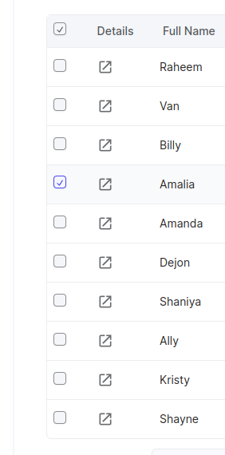
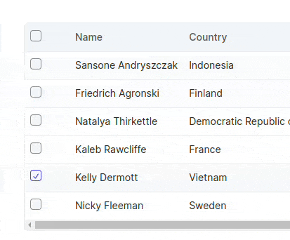
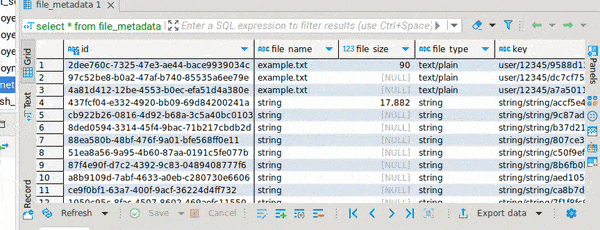

# Vidyayatan Infotech: Frontend Hiring Assignment

## How to submit the Assignment : [LINK](https://docs.google.com/forms/d/e/1FAIpQLSd-2gS4piDlG4IvAhW-e0494Z4oNiw04xoiTFZ9VOxf-QtVKQ/viewform)

-   Fork this repository
-   Solve the tasks and commit the changes in your forked repository (**DO NOT** open a PR on this repository)
-   Deploy the changes to your preferred vendor (we recommend [Render](https://render.com/), [Vercel](https://vercel.com/) and [netlify](https://www.netlify.com/))
-   Submit the assignment using [This Google form](https://docs.google.com/forms/d/e/1FAIpQLSd-2gS4piDlG4IvAhW-e0494Z4oNiw04xoiTFZ9VOxf-QtVKQ/viewform)

## Project setup instructions

1. Install `nvm` to manage node versions, Make sure you are using Node.JS `v21.0.0`
1. Install `pnpm` from [LINK](https://pnpm.io/)
1. Make sure that your vs-code is using the same ts version as the current project
1. Run `pnpm install` to install dependencies
1. Run `pnpm run dev` to start the dev server
1. Run `pnpm run precommit` to check if your code passes ts checks and linter checks

## Additional Information

-   The project uses [ShadCN](https://ui.shadcn.com/) as the UI library
-   The project uses [TanstackTable](https://tanstack.com/table/latest) for managing tables
-   Additional resources : [Tailwind](https://tailwindcss.com/)
-   Sample Tool used for task 2 and 3 : [DBeaver](https://dbeaver.io/)

## Assignment Tasks

### 1. **Add a new checkbox column**

-   [ ] Create a new checkbox column as the first column
-   [ ] On checking the column the selected row should be highlighted i.e background should change
-   [ ] Only a single column can be selected at a time across pages

**Examples:**

First column is a checkbox, on selecting the row notice the background of the selected row is slightly different from other rows
 

### 2. **Sticky Columns**

-   [ ] Create the first 2 columns as sticky columns
-   [ ] On hovering over the row the entire row's background should be highlighted including the sticky columns
-   [ ] To test this change either use mobile view or decrease the width of the table

### 3. **Resizable Columns**

-   [ ] Create resizable columns, i.e. the width of columns should increase or decrease depending on user interaction
-   [ ] If the content is too big to fit in a column, the content should not overflow out of the column i.e. overflow-hidden should be enforced

